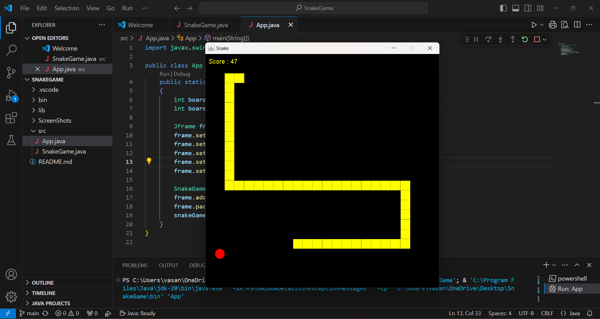

# Snake Game in Java

## Description

This project is a simple implementation of the classic Snake game using Java. It features a basic graphical interface created with Swing and AWT, where players control a snake to collect food, grow in length, and avoid collisions with walls and itself.

## Features

- **Gameplay**: Use arrow keys to control the direction of the snake.
- **Food Collection**: The snake grows when it eats food.
- **Game Over Conditions**: The game ends if the snake collides with the walls or itself.
- **Graphical Interface**: Rendered using Java Swing and AWT.
- **Dynamic Food Placement**: Food is placed randomly on the board.
- **Score Display**: The score is displayed and updated as the snake collects food.

## Technologies Used

- **Java**: The programming language used for the game logic and graphical interface.
- **Swing**: A part of the Java Foundation Classes (JFC) used for building the graphical user interface.
- **AWT**: Abstract Window Toolkit used for graphics and event handling in the game.

## Screenshots



## Installation

1. **Clone the repository**:
   ```bash
   git clone https://github.com/vasanthkrishnan/SnakeGame-java.git
